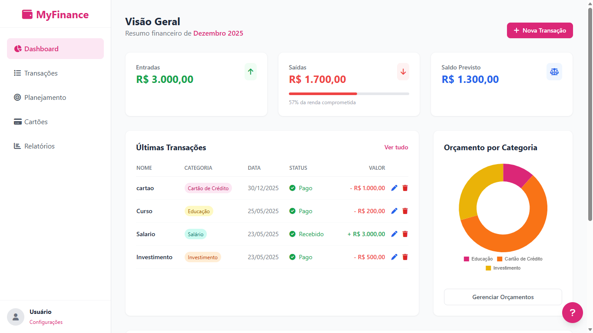
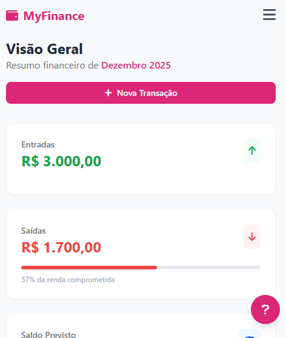

# 🌐 MyFinance Seu Sistema de Controle Financeiro

## Funcionalidades do Site 

### 1. **Dashboard (Visão Geral)**
- Exibe saldo total, receitas, despesas e percentual de gastos.
- Mostra gráficos de categorias para visualizar onde o dinheiro está sendo gasto.
- Resumo do mês atual e atalhos para páginas principais.

### 2. **Transações**
- Cadastro de entradas (receitas) e saídas (despesas).
- Edição e exclusão de transações.
- Filtros por categoria, data e tipo.
- Status de cada transação (paga, pendente, recebida).

### 3. **Planejamento / Metas Financeiras**
- Criação de metas: Limite de Gastos, Economia, Investimento, Pagamento de Dívida.
- Progresso automático conforme as transações são registradas.
- Barra de progresso colorida e mensagens motivacionais.
- Edição e exclusão de metas.

### 4. **Cartões**
- Cadastro de cartões de crédito com limite, bandeira, fechamento e vencimento.
- Controle do valor usado e disponível.
- Alertas visuais quando o limite está próximo de ser atingido.
- Edição e exclusão de cartões.

### 5. **Relatórios**
- Visualização detalhada de receitas e despesas por período.
- Gráficos comparativos entre categorias e meses.
- Exportação de dados para análise externa.

### 6. **Configurações**
- Personalização do nome do usuário.
- Escolha de cor do tema do site.
- Preferências salvas automaticamente (persistência local).

### 7. **Interface Responsiva**
- Funciona perfeitamente em computadores, tablets e celulares.
- Menus adaptativos e navegação intuitiva.

### 8. **Segurança e Privacidade**
- Todos os dados ficam salvos localmente no navegador.
- Nenhuma informação é enviada para servidores externos.

---

**Resumo:**  
O site MyFinance oferece controle total das finanças pessoais, com automação, visualização clara, metas inteligentes e personalização. Cada funcionalidade foi pensada para facilitar o acompanhamento do dinheiro, promover disciplina financeira e motivar o usuário a atingir seus objetivos!

---

## 🚀 Demonstração (GitHub Pages)
- Site publicado: `https://cleidson-danilo.github.io/MyFinance/`
- Navegue pelo `Dashboard` e pelas páginas em `paginas/`:
	- `Transações`, `Planejamento`, `Cartões`, `Relatórios`

## 🖼️ Prévia

> Imagens ilustrativas do Dashboard. Substitua pelos seus arquivos em `docs/`.





## 📦 Exportação e Importação de Dados
- Exportar JSON: baixa um arquivo com todas as transações, cartões e metas.
- Exportar Excel: gera um `.xlsx` com abas estilizadas (Resumo, Transações, Por Categoria, Metas, Cartões).
- Exportar PDF: cria um relatório visual com cabeçalho, estatísticas e tabelas.
- Importar JSON: restaura seus dados (backup) em outro navegador/computador.

## 🗂️ Armazenamento e Privacidade
- Os dados são salvos em `localStorage` do navegador (chave `myFinanceState`).
- Configurações (nome e cor) usam a chave `appConfig`.
- Nenhum dado é enviado para servidores externos.

## 🖥️ Desenvolvimento Local
Pré-requisitos (opcional para editar estilos): Node.js + TailwindCSS.

Comandos disponíveis:

```powershell
# Construir CSS uma vez
npm run build:css

# Assistir mudanças durante desenvolvimento
npm run watch:css
```

Abra o `index.html` diretamente no navegador ou use uma extensão de servidor local.

## 🧭 Estrutura do Projeto
```
index.html
paginas/
	├── transacoes.html
	├── planejamento.html
	├── cartoes.html
	└── relatorios.html
css/
	└── style.css
js/
	├── app.js
	├── config.js
	├── relatorios.js
	└── vendor/
			└── chart.umd.min.js
```

		> Para atualizar as imagens da prévia do README, adicione `docs/preview-desktop.png` e `docs/preview-mobile.png`. Consulte `docs/README_IMAGES.md` para instruções rápidas.

## 🔧 Dicas e Solução de Problemas
- Se o site publicado não refletir mudanças de estilo, force atualização: `Ctrl+F5`.
- Em `Relatórios`, os gráficos aparecem quando houver dados registrados no período.
- Caso os botões de exportação não baixem arquivos, verifique permissões de pop-up/download no navegador.

## 🌐 Compatibilidade
- Testado em navegadores modernos (Chrome, Edge, Firefox). 
- Em dispositivos móveis, utilize orientação vertical para melhor experiência nas páginas de formulário.

## 🗺️ Roadmap (Ideias Futuras)
- Filtro avançado por múltiplas categorias.
- Tagging e busca rápida nas transações.
- Exportação incremental (apenas período atual).
- Temas adicionais e modo escuro nativo.

